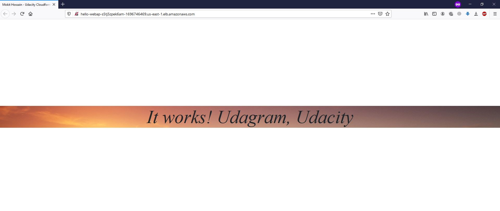

## Deploy a high-availability web app using CloudFormation

### Problem Statement of Project
Your company is creating an Instagram clone called Udagram. Developers pushed the latest version of their code in a zip file located in a public S3 Bucket.

You have been tasked with deploying the application, along with the necessary supporting software into its matching infrastructure.

This needs to be done in an automated fashion so that the infrastructure can be discarded as soon as the testing team finishes their tests and gathers their results.


### Installation Dependencies
```
$ pip3 install awscli --upgrade --user
```

### Diagram of the Infrastructure


### Deployment Instruction for the Infrastructure
```
$ ./create.sh stackName network_infrastructure.yml infrastructure_parameters.json
```

### Output of Project
